# Rapport de présentation — Projet 2 (DevSecOps) — Application santé

**Projet :** `dossier-sante-api`  
**Groupe :**
- Christopher Mangoumbou
- Mbamba Sene
- Mohamed SARR
- Sidi yaya traore
- Souleymane Sy
- Thierno Maadjou Sow
- Youssou NDIAYE
**Date :** 01/05/2026  

---

## Objectif

Présenter le démarrage et l’exécution du projet **avec Docker** (MySQL + Jenkins + SonarQube), puis démontrer un pipeline DevSecOps intégrant :

- build & tests Maven
- scan secrets (Gitleaks)
- SCA (OWASP Dependency-Check)
- SAST/qualité (SonarQube)
- **build & push image Docker** sur Docker Hub

> Les captures d’écran sont stockées dans `docs/captures/` et intégrées ci-dessous.

---

## 1) Architecture & composants

### 1.1 Services

- **API Spring Boot** : `http://localhost:8090` (lancée via `mvn spring-boot:run`)
- **MySQL (Docker)** : port **3307**
- **Jenkins (Docker)** : `http://localhost:8098`
- **SonarQube (Docker)** : `http://localhost:9000`

### 1.2 Démarrage (commandes)

MySQL (dans `projet1-application-sante/`) :

```bash
docker compose up -d
```

Jenkins + SonarQube (dans `projet1-application-sante/jenkins/`) :

```bash
docker compose up -d
docker compose ps
```

API :

```bash
mvn spring-boot:run
```

---

## 2) Preuves de fonctionnement (captures)

### 2.1 Docker (conteneurs en exécution)

**Capture attendue :** sortie de `docker ps` montrant `sante-mysql`, `sante-dossier-jenkins`, `sante-dossier-sonarqube` (UP).

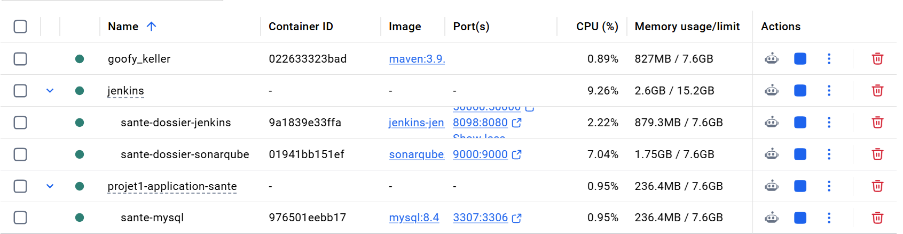

### 2.2 Swagger / API

**Capture attendue :** page Swagger UI (ou page `/v3/api-docs`) accessible.

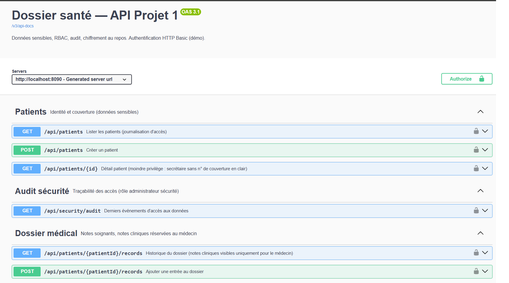

### 2.3 Jenkins (UI)

**Capture attendue :** page Jenkins (login ou dashboard).

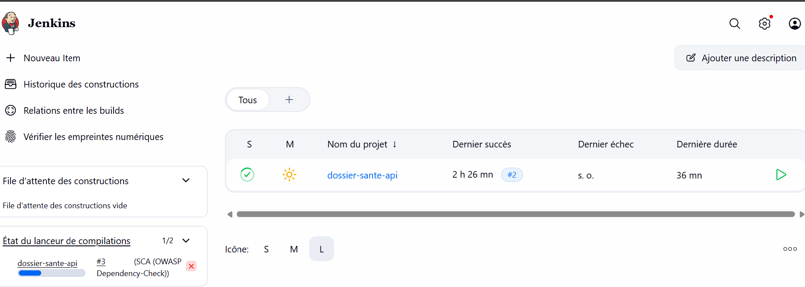

### 2.4 SonarQube (UI)

**Capture attendue :** page SonarQube (login ou dashboard).

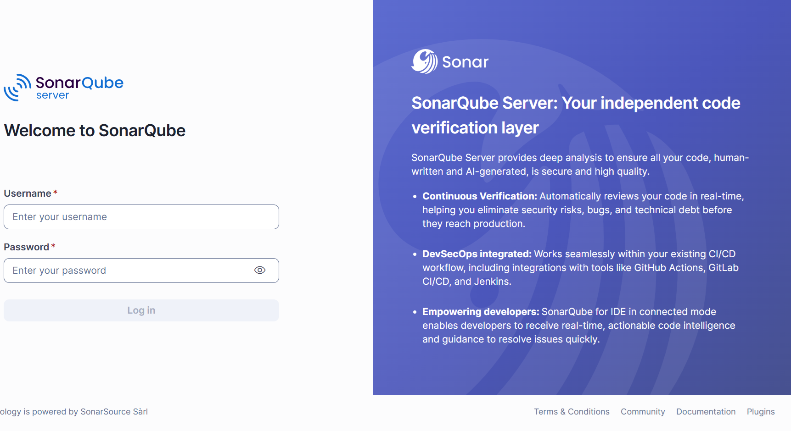

---

## 3) Pipeline Jenkins (exécution et résultats)

### 3.1 Configuration du job (branche)

**Capture attendue :** configuration SCM montrant la branche `*/equipe/youssou`.

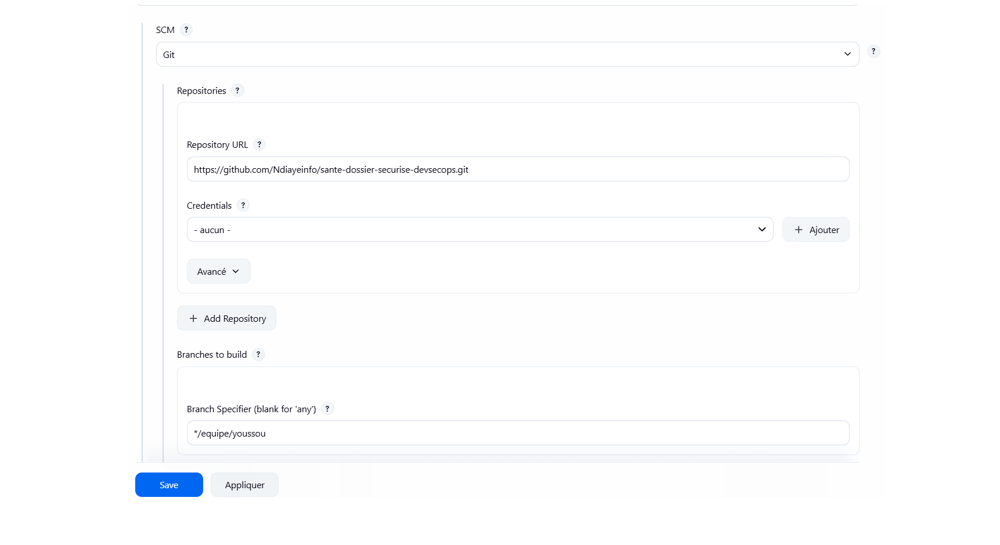

### 3.2 Build déclenché après un push

**Capture attendue :** historique des builds + log montrant un déclenchement suite à un changement (Poll SCM ou webhook).

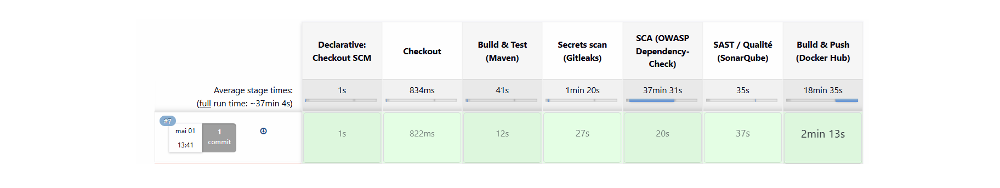

### 3.3 Étape Maven (build & tests)

**Capture attendue :** console Jenkins montrant `mvn verify` OK.

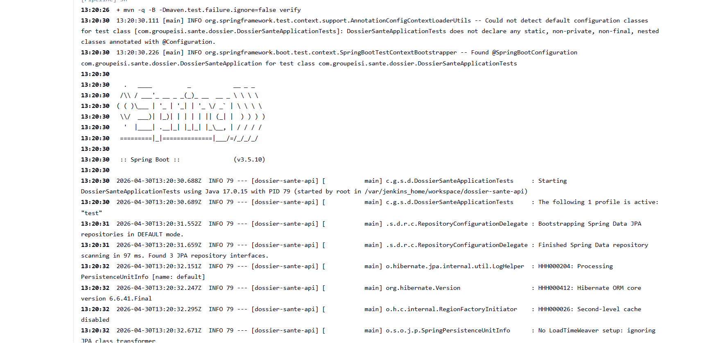

### 3.4 Gitleaks (secrets)

**Capture attendue :** étape Gitleaks + artefact `gitleaks.sarif` archivé.

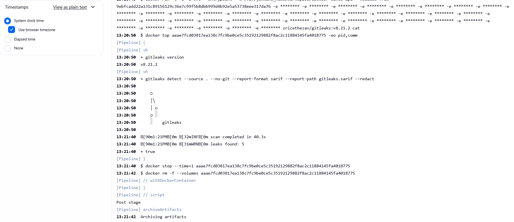

### 3.5 OWASP Dependency-Check (SCA)

**Capture attendue :** étape OWASP + artefacts `dependency-check/**` archivés.

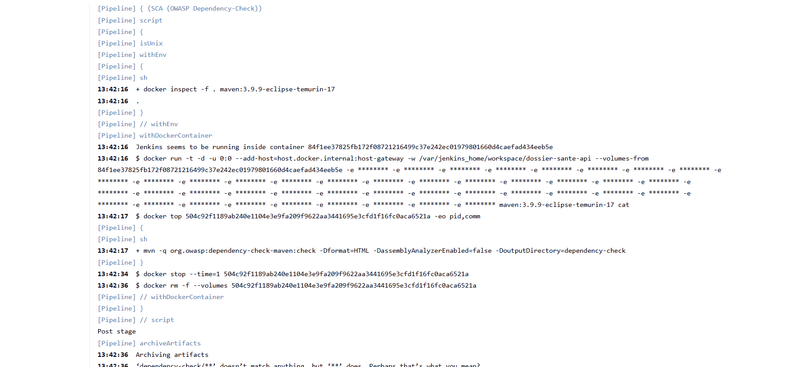

### 3.6 SonarQube (SAST / qualité)

**Capture attendue :** console Jenkins montrant l’analyse Sonar + capture du dashboard Sonar.

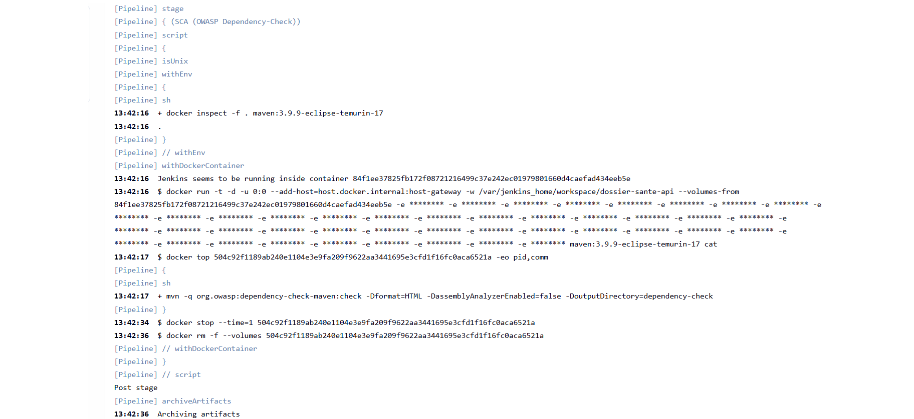
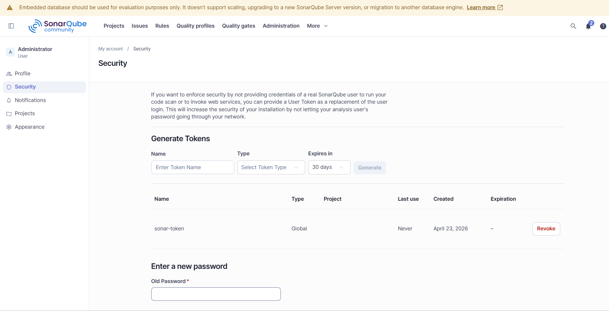

---

## 4) Publication de l’image Docker (Docker Hub)

### 4.1 Pré-requis : credentials Jenkins (Docker Hub)

Le pipeline n’embarque **aucun secret** dans Git. Un credential Jenkins est requis :

- Type : **Username with password**
- ID : `dockerhub`
- Username : `ndiayeinf`
- Password : **Docker Hub Access Token**

**Capture attendue :** credential `dockerhub` présent dans Jenkins (sans afficher le secret).

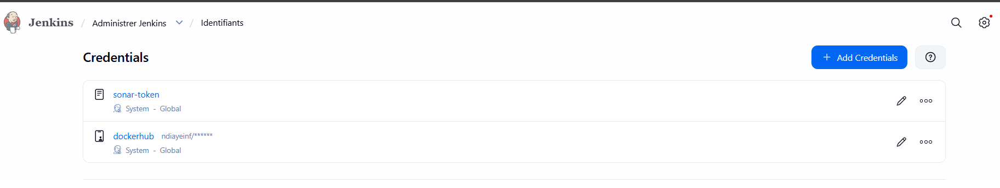

### 4.2 Exécution du push (stage Jenkins)

**Capture attendue :** stage “Build & Push (Docker Hub)” en succès.

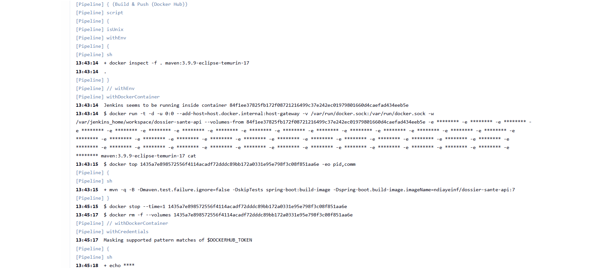

### 4.3 Preuve sur Docker Hub

**Capture attendue :** dépôt `ndiayeinf/dossier-sante-api` avec tags `latest` et `${BUILD_NUMBER}`.

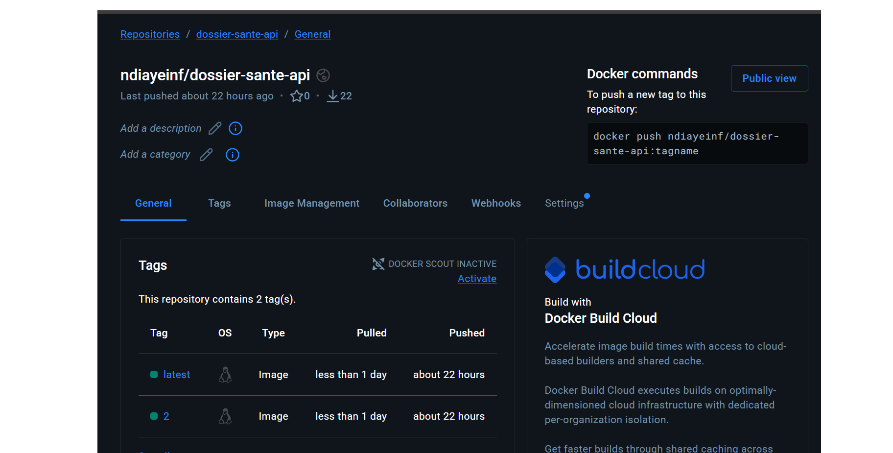

---

## 5) Conclusion

- Le projet démarre localement via Docker (MySQL / Jenkins / SonarQube) et Maven (API).
- Le pipeline Jenkins exécute les contrôles DevSecOps et publie une image Docker sur Docker Hub (tags `latest` + `${BUILD_NUMBER}`).
- Les secrets (tokens) restent **dans Jenkins Credentials**, jamais dans le dépôt.

---

## Annexes

- Rapport détaillé vulnérabilités : `docs/rapport-vulnerabilites-projet2.md`

